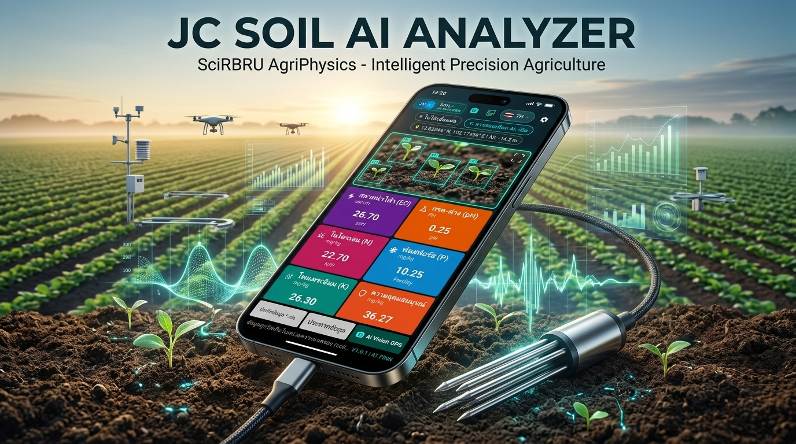

# 🌱 JC AI SOIL ANALYZER (แอปพลิเคชันตรวจวัดคุณภาพดิน 8 พารามิเตอร์อัจฉริยะ)
## Digital Agriphysics & Edge PINN Deep Learning Soil Diagnostics



> 📢 **PR Media Kit & Marketing Assets**: ดูชุดภาพประชาสัมพันธ์ สื่อมวลชน และแคปชันทางการได้ที่ [pr_media_kit.html](pr_media_kit.html)

แอปพลิเคชันมือถือพัฒนาด้วย **Flutter** ออกแบบและพัฒนาเพื่อเชื่อมต่อกับหัววัด **8-in-1 Soil Parameter Probe (USB Type-C OTG / RS485 Modbus RTU)** ตรวจวัดคุณภาพดินในเขตรากพืช แสดงผลแบบ Real-time ผสานโมเดล **Physics-Informed Neural Networks (PINN)** ชดเชยความคลาดเคลื่อนจากอุณหภูมิ พร้อมระบบสามภาษา (ไทย 🇹🇭 / อังกฤษ 🇬🇧 / จีน 🇨🇳), กล้อง AI Vision บันทึกภาพ/วิดีโอพร้อมแผง HUD ตัดเสียงรบกวน, คลังภาพและข้อมูลวิจัยมัลติโมดอล และระบบดาวน์โหลดคู่มือวิชาการ PDF ฉบับสมบูรณ์ในตัว

---

## 🌟 จุดเด่นและคุณสมบัติใหม่ล่าสุด (Latest Key Features)

1. **ตราสัญลักษณ์แบรนด์ไฮเทค 2 คอลัมน์ (Unified Two-Column Brand Logo):**
   - คอลัมน์ซ้าย: แบดจ์ `JC AI` เกรเดียนท์น้ำเงิน-ฟ้าเทคโนโลยี (สลับเป็นสีทองอำพันใน Simulation Mode)
   - เส้นแบ่งมิติแสง Cyber-optics
   - คอลัมน์ขวา: สองบรรทัด `SOIL` พร้อมจุดเขียวมรกตเรืองแสง + `AI ANALYZER` ตัวพิมพ์ใหญ่สีเขียวน้ำทะเลนีออน
2. **ระบบสามภาษาสมบูรณ์แบบ (Tri-Lingual Localization: 🇹🇭 TH / 🇬🇧 EN / 🇨🇳 ZH):**
   - ค่าเริ่มต้นเป็น **ภาษาไทย (Thai)** สำหรับเกษตรกรและนักวิชาการท้องถิ่น
   - สลับเป็น **ภาษาอังกฤษ (English)** หรือ **ภาษาจีน (Chinese)** ได้ทันทีผ่านปุ่มธงชาติบน Header
   - สลับแบบ **Reactive Zero-Restart** ไม่ต้องปิดแอป พร้อมจดจำภาษาออฟไลน์
3. **กล้อง AI Vision & Live Telemetry HUD พร้อมระบบตัดเสียงรบกวน (Noise Cancellation Toggle):**
   - เป้าเล็งระนาบหน้าดิน `[ + ] SOIL TARGET ZONE`
   - ฝังแผงพารามิเตอร์ 8-in-1, พิกัด GPS สด, และค่าชดเชย AI PINN ลงบนภาพถ่ายโดยตรง
   - บันทึกวิดีโอพร้อมปุ่มสลับเปิดไมโครโฟน หรือ **ตัดเสียงรบกวนภายนอก (Silent / Noise Cut)** เพื่อตัดเสียงลมและเครื่องจักร
4. **คลังภาพและข้อมูลวิจัยมัลติโมดอล (Soil Dataset Gallery):**
   - จัดเก็บภาพถ่าย วิดีโอ และตาราง CSV พร้อมดัชนี `dataset_manifest.json`
   - ซูมดูเนื้อดิน (Pinch-to-zoom 4x) และแชร์ชุดข้อมูลวิจัยไปยัง LINE, Drive, Gmail
5. **ระบบดาวน์โหลดคู่มือวิชาการ PDF ในตัว (In-App PDF Manual Download & Share):**
   - เข้าถึงผ่านเมนูการตั้งค่า (Settings) -> **ดาวน์โหลดคู่มือการใช้งาน (Download User Manual PDF)** ขนาด 1.5 MB (60 หน้า)
   - บันทึกลงโฟลเดอร์ `Download` ของเครื่องสมาร์ตโฟนโดยตรง และเปิดอ่านหรือส่งต่อผ่าน Native Share Sheet ได้ทันที
6. **การเชื่อมต่อ USB OTG อัตโนมัติ (Instant Auto-Connect & Hotplug):**
   - เสียบสายหัววัดใช้งานได้ทันที ระบบจับคู่ Baud Rate 4800 / 9600 bps อัตโนมัติใน 0.8 วินาที
   - Polling Rate ปรับแต่งได้ 350 ms (Turbo ~2.8Hz) หรือ 400 ms (Fast ~2.5Hz)
7. **สถาปัตยกรรมแถบสถานะส่วนหัว 2 คอลัมน์ (Two-Column StatusHeader):**
   - คอลัมน์ซ้าย: การ์ดโลโก้ทรงสูงกรอบเขียวนีออน (`#00E676`) ปรับความสูงด้วย `IntrinsicHeight`
   - คอลัมน์ขวา (3 แถว): แถว 1 เครื่องมือ (กล้อง, คลังภาพ, ภาษา 🇹🇭 TH, ปุ่มวงกลมการตั้งค่าสี Dark Teal `#0B556A`) / แถว 2 สถานะเชื่อมต่อ USB และ AI / แถว 3 พิกัดดาวเทียม Lat Long Alt
8. **หน้าต่างผลวิเคราะห์ปฐพีวิทยาและใบสั่งสูตรปุ๋ยไร้การล้นจอ (Anti-Overflow Dual-Tab Soil Diagnostics):**
   - ดัชนีสุขภาพดินรวม (Soil Health Score 0-100) และ Mini Status Chips 4 มิติ
   - แท็บ 1 ข้อเสนอแนะเชิงลึก: อัตราปูนโดโลไมต์แก้ดินกรด, รอบการให้น้ำ, ใบสั่งสูตรปุ๋ยเฉพาะแปลง NPK, การล้างเกลือความเค็ม และการใช้เชื้อราไตรโคเดอร์มา
   - แท็บ 2 แถบสีเคมี LDD/FAO 4 การทดสอบแบบการ์ดสองบรรทัด พร้อมปุ่มคัดลอกรายงานสรุปในคลิกเดียว
9. **ระบบสร้างใบรายงานผลตรวจดินมาตรฐาน A4 (Automated Soil Health Certificate Generator):**
   - ออกใบรับรองสุขภาพดินขนาดมาตรฐาน A4 อัตโนมัติ พร้อมตราสัญลักษณ์ SciRBRU AgriPhysics มหาวิทยาลัยราชภัฏรำไพพรรณี
   - สรุปผลการตรวจวัด 8 พารามิเตอร์เทียบเกณฑ์มาตรฐานสากล FAO และกรมพัฒนาที่ดิน พร้อมใบสั่งสูตรปุ๋ยเฉพาะแปลง
   - บันทึกจัดเก็บใน `soil_dataset/data/SOIL_REPORT_<sampleId>.html` พร้อมสั่งพิมพ์ (Print to PDF) หรือแชร์ผ่าน LINE ได้ทันที
10. **ระบบแผนที่แปลงดินเชิงพื้นที่และความอุดมสมบูรณ์ (GIS Soil Spatial Map & Heatmap):**
    - แผนที่แปลงดินแบบเวกเตอร์โต้ตอบได้ 60 FPS (Pinch-to-zoom / Pan) ใช้งานได้ 100% แม้ไม่มีสัญญาณอินเทอร์เน็ต
    - สลับเลเยอร์สี: สุขภาพดินรวม (Health Score), กรด-ด่าง (pH), ความชื้น (Moisture), สภาพนำไฟฟ้า (EC), และธาตุอาหาร N-P-K
    - ส่งออกไฟล์เชิงพื้นที่มาตรฐานสากล **GeoJSON** (สำหรับโปรแกรม QGIS/ArcGIS) และ **KML** (สำหรับ Google Earth / โดรนเกษตร)
11. **กรอบข้อเสนอแนะเชิงกลยุทธ์ 5 มิติ (5-Dimensional Strategic Roadmap):**
    - บันทึกแนวทางการพัฒนาสู่อนาคต: แผ่นเทียบสีชดเชยแสง, วิเคราะห์เนื้อดิน, หัววัดไร้สาย BLE, แผนที่ดิน GIS, และการจดแจ้งทรัพย์สินทางปัญญา

---

## 🔌 ข้อกำหนดฮาร์ดแวร์และการสื่อสาร (Hardware Interface & Protocol)

### 1. การเชื่อมต่อ USB Type-C OTG
- หัวโพรบ **Soil Parameter Tester** เชื่อมต่อโดยตรงเข้ากับพอร์ต Type-C ของสมาร์ตโฟน/แท็บเล็ต Android ในโหมด **USB Host (OTG)**
- ภายในมีชิป USB-to-UART/RS485 บริดจ์ เช่น **CH340, CP2102, FTDI หรือ PL2303**
- แอปพลิเคชันมี `device_filter.xml` และระบบขออนุญาตสิทธิ์การเข้าถึง USB อัตโนมัติ

### 2. โปรโตคอล Modbus RTU Framing
- **Baud rate:** `4800 bps` (ค่าเริ่มต้นมาตรฐานของหัววัดดินจีน) หรือ `9600 bps`
- **Data frame:** `8-N-1` (8 Data bits, No parity, 1 Stop bit)
- **Slave ID:** `0x01`
- **คำสั่งอ่านข้อมูล 8 พารามิเตอร์ (Function 0x03):**
  ```hex
  01 03 00 00 00 08 44 0C
  ```
- **โครงสร้างข้อมูลตอบกลับ (Response Frame 21 Bytes):**
  ```
  [01] [03] [10] [Moisture 2B] [Temp 2B] [EC 2B] [pH 2B] [N 2B] [P 2B] [K 2B] [Fertility 2B] [CRC_L] [CRC_H]
  ```

| Register Offset | Parameter | Scale Factor | Range | Unit |
| :---: | :--- | :---: | :---: | :---: |
| `0x0000` | Soil Moisture | `/ 10.0` | 0.0 - 100.0 | `%` |
| `0x0001` | Soil Temperature | `/ 10.0` (Signed) | -40.0 - 80.0 | `°C` |
| `0x0002` | Electrical Conductivity (EC) | `1.0` | 0 - 20,000 | `µS/cm` |
| `0x0003` | Soil pH | `/ 10.0` หรือ `/ 100.0` | 3.00 - 10.00 | `pH` |
| `0x0004` | Nitrogen (N) | `1.0` | 0 - 1,999 | `mg/kg` |
| `0x0005` | Phosphorus (P) | `1.0` | 0 - 1,999 | `mg/kg` |
| `0x0006` | Potassium (K) | `1.0` | 0 - 1,999 | `mg/kg` |
| `0x0007` | Soil Fertility Index | `1.0` | 0 - 1,999 | `mg/kg` |

---

## 🏗️ โครงสร้างโค้ดตาม Clean Architecture (MVVM)

```
lib/
├── core/
│   ├── constants/
│   │   ├── app_colors.dart         # รหัสสี 8 พารามิเตอร์
│   │   └── sensor_constants.dart   # ค่าคงที่ Modbus, ค่าเริ่มต้น
│   └── theme/
│       └── app_theme.dart          # ธีม Material 3 คอนทราสต์สูง
├── data/
│   ├── models/
│   │   ├── soil_reading.dart       # โมเดลข้อมูลและแปลง CSV
│   │   └── modbus_parser.dart      # ตัวถอดรหัส Modbus RTU & CRC-16
│   ├── services/
│   │   ├── usb_sensor_service.dart # ติดต่อฮาร์ดแวร์ USB Serial & Simulator
│   │   └── export_service.dart     # จัดการบันทึกและแชร์ไฟล์
│   └── repositories/
│       └── soil_sensor_repository.dart # บัฟเฟอร์ประวัติข้อมูล 1,000 จุด
├── domain/
│   └── models/
│       └── agronomic_assessment.dart # เครื่องมือวิเคราะห์ปฐพีวิทยา
└── ui/
    ├── viewmodels/
    │   └── soil_sensor_viewmodel.dart # ChangeNotifier จัดการ State
    ├── views/
    │   ├── home_dashboard_screen.dart # หน้าหลัก 8 การ์ดพารามิเตอร์
    │   ├── historical_data_screen.dart# หน้ารายการบันทึกข้อมูลย้อนหลัง
    │   └── settings_screen.dart     # หน้าตั้งค่า Baud rate และฮาร์ดแวร์
    └── widgets/
        ├── parameter_card.dart       # วิดเจ็ตการ์ดพารามิเตอร์
        ├── status_header.dart        # แถบ Header แสดงสถานะ USB
        └── agronomic_summary_sheet.dart # แผ่นป๊อปอัปคำแนะนำการใส่ปุ๋ย
```

---

## 🚀 วิธีการทดสอบและใช้งาน

### 1. ทดสอบโหมดจำลอง (Interactive Demo Simulation)
- เมื่อเปิดแอปพลิเคชัน สามารถกดที่ไอคอน **ขวดทดลอง/สัญลักษณ์วิทยาศาสตร์** ที่มุมซ้ายบนของ Header เพื่อเปิด **Simulation Mode**
- แอปจะจำลองสตรีมข้อมูลที่มีการเคลื่อนไหวตามธรรมชาติของดินจริงแบบไดนามิก เพื่อทดสอบการเรนเดอร์ UI และฟังก์ชันบันทึกข้อมูลได้ทันทีโดยไม่ต้องต่อฮาร์ดแวร์

### 2. รันบนเครื่องจริง Android (USB OTG)
```bash
# ติดตั้ง dependencies
flutter pub get

# รันแอปไปยังอุปกรณ์ Android ที่ต่อผ่าน USB Debugging
flutter run -d <android-device-id>

# หรือบิลด์เป็นไฟล์ APK สำหรับนำไปติดตั้งในสมาร์ตโฟน
flutter build apk --release
```
*ไฟล์ APK จะถูกสร้างขึ้นที่ `build/app/outputs/flutter-apk/app-release.apk`*

---

## 🌾 ฟังก์ชันการประเมินทางปฐพีวิทยา (Agronomic Assessment)
เมื่อแตะที่การ์ดพารามิเตอร์ใดๆ ระบบจะแสดง **Agronomic Summary Sheet**:
- **ประเมินความชื้น:** แจ้งเตือนดินแห้ง (ขาดน้ำ) หรือดินแฉะ (เสี่ยงรากเน่า)
- **ประเมินความเค็ม:** เตือนอันตรายจากเกลือปุ๋ยสะสมเกินมาตรฐาน
- **ประเมินกรด-ด่าง:** คำแนะนำการใส่โดโลไมต์ปรับปรุงดินกรด หรือยิปซัมปรับปรุงดินด่าง
- **สัดส่วน N-P-K:** สรุปปริมาณธาตุอาหารหลัก 3 ตัวเพื่อวางแผนการใส่ปุ๋ยแม่นยำ
