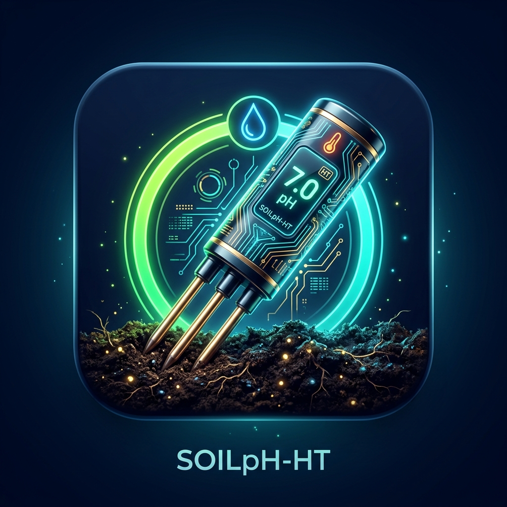

# คู่มือฉบับสมบูรณ์ การออกแบบ พัฒนา ติดตั้ง สอบเทียบ และประยุกต์ใช้งานแอปพลิเคชัน SoilpH-HT AI

<p align="center">
  
</p>

**สาขาวิชาฟิสิกส์ คณะวิทยาศาสตร์และเทคโนโลยี มหาวิทยาลัยราชภัฏรำไพพรรณี**  
*โครงการวิจัยฟิสิกส์เกษตรดิจิทัลและปัญญาประดิษฐ์ฝังตัว (Digital Agriphysics & Embedded AI)*

---

## สารบัญเนื้อหาหลัก

1. บทนำและสถาปัตยกรรมภาพรวมของระบบตรวจวัดค่ากรด-ด่างดิน (System Overview)
2. การจัดเตรียมสภาพแวดล้อมและติดตั้งเครื่องมือสำหรับผู้เริ่มต้น (Zero-to-Hero Setup)
3. สถาปัตยกรรมฮาร์ดแวร์และการเชื่อมต่อผ่าน USB-C OTG (Hardware & Interface)
4. รากฐานทางฟิสิกส์และแบบจำลองโครงข่ายประสาทเทียม PINN (Physics-Informed Neural Network)
5. สถาปัตยกรรมซอฟต์แวร์และการพัฒนาแอปพลิเคชัน Flutter (Clean Architecture & MVVM)
6. ระบบส่วนต่อประสานผู้ใช้แบบปรับขนาดอัตโนมัติและป้องกันข้อมูลล้นจอ (Responsive UI)
7. ระบบกล้อง AI Vision การประทับพิกัดดาวเทียม และคลังภาพดิน (AI Camera & Dataset)
8. ระเบียบวิธีสอบเทียบในห้องปฏิบัติการตามมาตรฐานสากล EURACHEM (Laboratory Calibration)
9. การประยุกต์ใช้งานจริงในแปลงปลูกทุเรียนและใบสั่งปูนโดโลไมต์ (Field Agronomic Operations)
10. การคอมไพล์ ติดตั้งลงบนสมาร์ตโฟน และคู่มือแก้ปัญหาภาคสนาม (Deployment & Troubleshooting)

---

## 1. บทนำและวัตถุประสงค์การวิจัย (Research Objectives & System Overview)

ระบบ **SoilpH-HT AI** ได้รับการวิจัยและพัฒนาขึ้นเพื่อเป็นเครื่องมือตรวจวัดและวิเคราะห์ค่าความเป็นกรด-ด่างของดิน (Soil pH) ซึ่งเป็นตัวแปรควบคุมหลัก (Master Variable) ทางปฐพีวิทยาที่มีอิทธิพลชี้ขาดต่อความสามารถในการละลายและการดูดซึมธาตุอาหารของพืชเศรษฐกิจ โดยเฉพาะอย่างยิ่ง **ทุเรียนหมอนทองในแถบจังหวัดจันทบุรีและตราด**

### 1.1 วัตถุประสงค์การวิจัย 3 ประการหลัก

โครงการวิจัยนี้มีเป้าหมายและขอบเขตการดำเนินงานที่ตอบสนองต่อ 3 วัตถุประสงค์หลัก ดังนี้:

1. **วัตถุประสงค์ที่ 1:** เพื่อศึกษาและสร้างชุดข้อมูลความสัมพันธ์ระหว่างค่าศักย์ไฟฟ้าของเซนเซอร์วัดค่าความเป็นกรด-เบสของดิน (Soil pH) กับค่าอุณหภูมิ และค่า Soil pH มาตรฐาน สำหรับพัฒนาโมเดลปัญญาประดิษฐ์
   * การแปลงสัญญาณไฟฟ้าเคมีของเซนเซอร์เป็นค่าศักย์ไฟฟ้าของอิเล็กโทรด ($E_{\text{sensor}}$ ในหน่วยมิลลิโวลต์, mV) ร่วมกับอุณหภูมิสัมบูรณ์ ($T$) 
   * การสร้างชุดข้อมูลคู่มาตรฐาน (Standard Calibration Dataset) ร่วมกับสารละลายบัฟเฟอร์มาตรฐาน NIST (pH 4.01, 7.00, 10.01) และตัวอย่างดินแปลงปลูกที่มีการสอบเทียบในห้องปฏิบัติการ
   * การจัดเตรียมชุดข้อมูลพร้อมฟีเจอร์เมทริกซ์ในรูปแบบไฟล์ CSV สำหรับฝึกสอนโมเดลโครงข่ายประสาทเทียม

2. **วัตถุประสงค์ที่ 2:** เพื่อพัฒนาโมเดลปัญญาประดิษฐ์ที่สามารถชดเชยความคลาดเคลื่อนในการวัดที่เกิดจากผลของอุณหภูมิ (Temperature Effect) และความไม่เป็นเชิงเส้น (Non-linearity) ของเซนเซอร์
   * การออกแบบสถาปัตยกรรม Physics-Informed Neural Network (PINN) แบบแยกองค์ประกอบ (Decoupled Formulation)
   * การชดเชย **ผลของอุณหภูมิ (Temperature Effect: $\Delta \text{pH}_{\text{temp}}$)** อันได้แก่ ความชันเนิร์นสต์ (Nernstian Thermal Slope Variance) และการเลื่อนสมดุลการแตกตัวของสารละลายดิน ($pK_w(T)$)
   * การชดเชย **ความไม่เป็นเชิงเส้นของเซนเซอร์ (Sensor Non-linearity: $\Delta \text{pH}_{\text{nonlinear}}$)** อันเกิดจากปรากฏการณ์ Sub-Nernstian Response ในช่วงกรดจัด/ด่างจัด, Asymmetry Potential, ความต้านทานฟิล์มแก้ว/เมมเบรน, และสหสัมพันธ์แบบไม่เป็นเชิงเส้นร่วมกับความชื้นและสภาพนำไฟฟ้า

3. **วัตถุประสงค์ที่ 3:** เพื่อทดสอบประสิทธิภาพของชุดทดสอบค่าความเป็นกรด-ด่างของดินแบบพกพาภาคสนามที่มีการชดเชยความคลาดเคลื่อนโดยปัญญาประดิษฐ์ โดยเปรียบเทียบความแม่นยำกับเครื่องมือวัดมาตรฐาน และทดสอบจริงในภาคสนาม (สวนผลไม้ทุเรียนในจังหวัดจันทบุรีและตราด)
   * การประเมินความใช้ได้ของวิธีตามมาตรฐานสากล EURACHEM Guide และ ISO/IEC 17025
   * การเปรียบเทียบผลการวัดภาคสนามระหว่างชุดทดสอบพกพาชดเชยด้วย AI ($\text{pH}_{\text{AI}}$) เทียบกับเครื่องมือวัดมาตรฐานระดับห้องปฏิบัติการ (Standard Benchtop pH Meter: Glass Electrode) ในสวนทุเรียนจริงครอบคลุมพื้นที่ **จ.จันทบุรี (ท่าใหม่, เขาคิชฌกูฏ, ขลุง, มะขาม)** และ **จ.ตราด (เขาสมิง, บ่อไร่, แหลมงอบ, เมืองตราด)**
   * การวิเคราะห์ทางสถิติ: RMSE, MAE, %Bias (< 1.0%), สัมประสิทธิ์การตัดสินใจ ($R^2 > 0.98$) และการทดสอบความแตกต่างอย่างมีนัยสำคัญ

---

## 2. การจัดเตรียมสภาพแวดล้อมและติดตั้งเครื่องมือสำหรับผู้เริ่มต้น
...
---

## 3. สถาปัตยกรรมฮาร์ดแวร์และการเชื่อมต่อผ่าน USB-C OTG

### 3.1 ผังการต่อสายสัญญาณฮาร์ดแวร์
หัววัดดินอุตสาหกรรม (Soil Parameter Tester) ประกอบด้วยสายสัญญาณมาตรฐาน 4 เส้น ต่อเข้ากับโมดูลแปลงสัญญาณ USB-RS485 Type-C ดังแสดงในตาราง

| สีของสายไฟ | สัญญาณทางไฟฟ้า | หน้าที่การทำงาน | การต่อเข้ากับโมดูล USB-RS485 |
| :--- | :--- | :--- | :--- |
| **สีแดง** | VCC | แรงดันไฟเลี้ยงบวก ($5 - 30\text{ โวลต์}$) | ขั้ว $5\text{V}$ จากพอร์ต OTG |
| **สีดำ** | GND | กราวด์ร่วมของระบบไฟฟ้า | ขั้ว GND บนโมดูล |
| **สีเหลือง** | RS485 A+ | สัญญาณผลต่างขั้วบวก (Data+) | ขั้ว A+ บนโมดูล |
| **สีน้ำเงินหรือเขียว** | RS485 B- | สัญญาณผลต่างขั้วลบ (Data-) | ขั้ว B- บนโมดูล |

### 3.2 การแปลงสัญญาณศักย์ไฟฟ้าอิเล็กโทรดเซนเซอร์ (Electrode Potential $E_{\text{sensor}}$ mV)
ตามทฤษฎีไฟฟ้าเคมี สัญญาณศักย์ไฟฟ้าของหัววัดกรด-ด่างสัมพันธ์กับความเข้มข้นของไฮโดรเนียมไอออน ($a_{\text{H}^+}$) และอุณหภูมิสัมบูรณ์ ($T$) ตามสมการเนิร์นสต์:

$$E_{\text{sensor}}(T, \text{pH}) = E_0 - S(T)(\text{pH} - \text{pH}_{\text{iso}})$$

โดยที่:
* $S(T) = \frac{2.3026 R T}{F} = 0.198414 \times (273.15 + T_{\text{soil}})\text{ (mV/pH)}$ เป็นความชันเนิร์นสเตียนเชิงทฤษฎี ซึ่งที่อุณหภูมิอ้างอิง $25^\circ\text{C}$ มีค่าเท่ากับ $59.16\text{ mV/pH}$
* $\text{pH}_{\text{iso}} = 7.00$ เป็นจุดศักย์ไฟฟ้าสมดุลศูนย์ (Isopotential Point, $E = 0\text{ mV}$)
* ระบบ **SoilpH-HT AI** จะคำนวณและบันทึกค่า $E_{\text{sensor}}$ (mV) นี้โดยตรงสำหรับทุกจุดตรวจวัดเพื่อใช้เป็นฟีเจอร์หลักในการเทรนโมเดล AI (ตอบสนองวัตถุประสงค์ที่ 1)

### 3.3 ผังรีจิสเตอร์ข้อมูล Modbus RTU
การสื่อสารใช้เฟรมคำสั่งมาตรฐาน Function Code 03 (Read Holding Registers) โดยมีผังรีจิสเตอร์ดังนี้
* **รีจิสเตอร์ 0** ค่าความชื้นในดิน ($M_{\text{soil}}$, ตัวคูณสเกลหารด้วย 10.0 หน่วยร้อยละ)
* **รีจิสเตอร์ 1** อุณหภูมิดิน ($T_{\text{soil}}$, ตัวคูณสเกลหารด้วย 10.0 หน่วยองศาเซลเซียส)
* **รีจิสเตอร์ 2** สภาพนำไฟฟ้า ($EC_{\text{raw}}$, จำนวนเต็ม หน่วยไมโครซีเมนต์ต่อเซนติเมตร)
* **รีจิสเตอร์ 3** ค่ากรด-ด่างดินดิบ ($\text{pH}_{\text{raw}}$, ตัวคูณสเกลหารด้วย 10.0)

---

## 4. รากฐานทางฟิสิกส์และการแยกแยะการชดเชยของโมเดล PINN (Objective 2)

แบบจำลอง **Physics-Informed Neural Network (PINN-SoilPhNet v2.6)** ได้รับการออกแบบเพื่อชดเชยความคลาดเคลื่อน 2 แหล่งสำคัญตามวัตถุประสงค์ที่ 2:
1. **ผลกระทบจากอุณหภูมิ (Temperature Effect)**
2. **ความไม่เป็นเชิงเส้นของเซนเซอร์ (Sensor Non-Linearity)**
ร่วมกับการชดเชยอิมพีแดนซ์รอยต่อสัมผัสในดินแห้ง

```
[ สัญญาณดิบ: pH_raw, T_soil, M_soil, EC, E_sensor (mV) ]
                          │
                          ▼
 ┌────────────────────────────────────────────────────────┐
 │ 1. การชดเชยผลของอุณหภูมิ (Temperature Effect)          │
 │    - Thermal Nernst Slope: ΔpH_Nernst                  │
 │    - Water Autoprotolysis Shift: ΔpH_dissoc            │
 │    => ΔpH_temp = ΔpH_Nernst + ΔpH_dissoc               │
 └────────────────────────────────────────────────────────┘
                          │
                          ▼
 ┌────────────────────────────────────────────────────────┐
 │ 2. การชดเชยความไม่เป็นเชิงเส้น (Sensor Non-Linearity)   │
 │    - Sub-Nernstian Degradation ในช่วง pH < 4.8 / > 7.5 │
 │    - Asymmetry Potential Membrane Curvature            │
 │    - Deep Residual PINN MLP (Swish + GELU Layers)      │
 │    => ΔpH_nonlinear = ΔpH_subNernst + ΔpH_PINN         │
 └────────────────────────────────────────────────────────┘
                          │
                          ▼
 ┌────────────────────────────────────────────────────────┐
 │ 3. การชดเชยอิมพีแดนซ์รอยต่อสัมผัสดิน (Matrix Effect)  │
 │    - Contact Impedance ในดินแห้ง M < 30%               │
 │    - Free-water Dilution ในดินน้ำขัง M > 65%           │
 │    => ΔpH_moisture                                     │
 └────────────────────────────────────────────────────────┘
                          │
                          ▼
[ ผลลัพธ์สมบูรณ์ pH_cal = clamp(pH_raw + ΔpH_temp + ΔpH_nonlinear + ΔpH_moisture, 3.0, 10.0) ]
```

### 4.1 สมการคณิตศาสตร์เชิงฟิสิกส์และการแยกแยะ (Decoupled Formulation)

1. **การชดเชยผลกระทบจากอุณหภูมิ (Temperature Effect: $\Delta \text{pH}_{\text{temp}}$)**
   $$\Delta \text{pH}_{\text{Nernst}} = (\text{pH}_{\text{raw}} - 7.0)\left(1 - \frac{298.15}{273.15 + T_{\text{soil}}}\right)$$
   $$\Delta \text{pH}_{\text{dissoc}} = -0.0065 \times (T_{\text{soil}} - 25.0)$$
   $$\Delta \text{pH}_{\text{temp}} = \Delta \text{pH}_{\text{Nernst}} + \Delta \text{pH}_{\text{dissoc}}$$

2. **การชดเชยความไม่เป็นเชิงเส้นของเซนเซอร์ (Sensor Non-Linearity: $\Delta \text{pH}_{\text{nonlinear}}$)**
   เมื่อค่า pH เบี่ยงเบนออกจากช่วงเป็นกลาง ($7.0$) หัววัดจริงจะมีพฤติกรรม Sub-Nernstian (ความชันต่ำกว่าทฤษฎี) จากการอิ่มตัวของไฮโดรเนียมไอออนบนพื้นผิวแก้ว/เมมเบรน:
   $$\Delta \text{pH}_{\text{subNernst}} = \begin{cases} 
   -0.035 \times (5.0 - \text{pH}_{\text{raw}})^{1.25}, & \text{เมื่อ } \text{pH}_{\text{raw}} < 5.0 \\ 
   +0.025 \times (\text{pH}_{\text{raw}} - 7.5)^{1.20}, & \text{เมื่อ } \text{pH}_{\text{raw}} > 7.5 \\ 
   0.0, & \text{ช่วงเป็นกลาง } 5.0 \le \text{pH}_{\text{raw}} \le 7.5
   \end{cases}$$
   ร่วมกับส่วนชดเชยไม่เชิงเส้นระดับสูงจากโครงข่ายประสาทเทียม PINN Residual:
   $$\Delta \text{pH}_{\text{nonlinear}} = \Delta \text{pH}_{\text{subNernst}} + \Delta \text{pH}_{\text{PINN}}$$

3. **การชดเชยอิมพีแดนซ์รอยต่อสัมผัสในดิน (Soil Moisture Impedance: $\Delta \text{pH}_{\text{moisture}}$)**
   $$\Delta \text{pH}_{\text{moisture}} = \begin{cases}
   -0.015 \times (30.0 - M_{\text{soil}})^{1.15}, & \text{เมื่อ } M_{\text{soil}} < 30\% \text{ (ดินแห้ง)} \\
   \text{sign}(\text{pH}_{\text{raw}} - 7.0) \times 0.007 \times (M_{\text{soil}} - 65.0), & \text{เมื่อ } M_{\text{soil}} > 65\% \text{ (ดินน้ำขัง)} \\
   0.0, & \text{ช่วงความชื้นเหมาะสม } 30\% \le M \le 65\%
   \end{cases}$$

### 4.2 การเปรียบเทียบประสิทธิภาพแบบแยกส่วน (Ablation Analysis)
ในแอปพลิเคชัน ผู้ใช้สามารถสลับทดสอบได้ 3 โหมดเพื่อพิสูจน์ผลลัพธ์:
* **Raw Uncompensated:** ค่าดิบจากหัววัด ไม่ผ่านการชดเชย
* **Conventional ATC (Linear):** ชดเชยเฉพาะความชันเนิร์นสต์เชิงเส้นตามอุณหภูมิแบบเครื่องวัดทั่วไป ($\text{pH}_{\text{ATC}} = \text{pH}_{\text{raw}} + \Delta \text{pH}_{\text{Nernst}}$)
* **Full AI PINN:** ชดเชยครบวงจร ทั้งผลของอุณหภูมิ ความไม่เป็นเชิงเส้น และความชื้นสัมผัส ให้ค่าความแม่นยำสูงสุดตามมาตรฐานสากล

## 5. สถาปัตยกรรมซอฟต์แวร์และการพัฒนาแอปพลิเคชัน Flutter

โครงสร้างโปรเจกต์จัดวางตามแบบแผน **Clean Architecture** และ **MVVM (Model-View-ViewModel)**

### 5.1 ผังโครงสร้างโปรเจกต์ (Project Hierarchy)
```
SoilpH_HT/
├── android/app/src/main/
│   ├── AndroidManifest.xml          # กำหนดสิทธิ์ USB Host, Camera, Storage, GPS
│   └── res/xml/device_filter.xml    # รายการชิป USB (CH340, CP2102, FTDI, PL2303)
├── assets/
│   ├── icons/app_icon.png           # ไอคอนแอปพลิเคชัน
│   └── docs/SoilpH_HT_Handbook.pdf  # คู่มือวิชาการฉบับสมบูรณ์ในตัวแอป
├── lib/
│   ├── core/constants/              # รหัสสี LDD/FAO และค่าคงที่ระบบ
│   ├── data/
│   │   ├── models/                  # SoilPhReading, GeoLocationData
│   │   ├── repositories/            # PhRepository (สลับระหว่าง USB จริงกับโหมดจำลอง)
│   │   └── services/                # UsbPhService, SoilTelemetryOverlayService
│   ├── domain/
│   │   ├── calibration/             # DeepLearningCalibrator (PINN Model)
│   │   └── agronomy/                # AgronomicRules และใบสั่งปูนโดโลไมต์
│   ├── ui/
│   │   ├── viewmodels/              # PhMonitorViewModel (ChangeNotifier)
│   │   ├── views/                   # PhDashboardScreen, SoilCameraScreen, Gallery, Settings
│   │   └── widgets/                 # PhCircularGauge (Responsive LayoutBuilder)
│   └── main.dart                    # Entry Point ผูก Dependency Injection
└── test/                            # ชุดทดสอบ Unit Tests
```

---

## 6. ระบบส่วนต่อประสานผู้ใช้แบบปรับขนาดอัตโนมัติและป้องกันข้อมูลล้นจอ

เพื่อแก้ปัญหาข้อความและกราฟิกล้นจอ (RenderFlex Overflow) บนสมาร์ตโฟนหลายขนาด แอปพลิเคชันได้รับการออกแบบด้วยเทคนิค Responsive ขั้นสูง ได้แก่
1. **มาตรวัด pH ทรงกลม PhCircularGauge** ครอบด้วย `LayoutBuilder` คำนวณเส้นผ่านศูนย์กลางแบบไดนามิก ($170 - 240\text{ px}$) ตามขนาดพื้นที่จริง
2. **แถบเครื่องมือและปุ่มควบคุม** ใช้ `FittedBox(fit: BoxFit.scaleDown)` ปรับลดขนาดตัวอักษรและไอคอนอัตโนมัติเมื่อรันบนหน้าจอขนาดเล็กกว่า 360 พิกเซล
3. **หน้าต่างกล้อง AI Vision** ใช้ `ClipRect` ร่วมกับ `FittedBox(fit: BoxFit.cover)` ป้องกันภาพกล้องบิดเบี้ยวและขยายเต็มพื้นที่จอทุกสัดส่วน (16:9 หรือ 20:9)

---

## 7. ระบบกล้อง AI Vision การประทับพิกัดดาวเทียม และคลังภาพดิน

### 7.1 การประทับข้อมูลโทรมาตรลงบนภาพถ่าย (Telemetry Overlay)
บริการ `SoilTelemetryOverlayService` ใช้ไลบรารี `dart:ui` วาดองค์ประกอบทางวิทยาศาสตร์ลงบนภาพถ่ายความละเอียดสูงโดยตรง
* แบนเนอร์หัวข้อด้านบน พร้อมระบุวันที่และเวลาบันทึก
* เป้าเล็งกึ่งกลาง Cyber Reticle `[ + ] SOIL pH TARGET` ระบุตำแหน่งการปักโพรบ
* แถบข้อมูลเทเลเมทรีด้านล่าง แสดงพิกัดดาวเทียม GPS ละติจูด ลองจิจูด ความสูง และค่ากรด-ด่างที่ผ่านการปรับเทียบ พร้อมเวกเตอร์การชดเชยอุณหภูมิและความชื้น

### 7.2 คลังภาพถ่ายออฟไลน์ (SoilDatasetGalleryScreen)
ภาพถ่ายทั้งหมดจะถูกจัดเก็บในเครื่อง พร้อมบันทึกเมทาดาทาลงในไฟล์ `dataset_manifest.json` รองรับการซูมขยายภาพได้ถึง 4 เท่า (Pinch-to-zoom) และสามารถกดปุ่มแชร์ภาพพร้อมพิกัดไปยังแอปพลิเคชันสื่อสารภายนอกได้ทันที

### 7.3 โมดูลสร้างชุดข้อมูลสำหรับฝึกสอนโมเดลปัญญาประดิษฐ์ (AI Dataset Builder - Objective 1)
เพื่อตอบสนองวัตถุประสงค์ที่ 1 แอปพลิเคชันมีหน้าจอเฉพาะสำหรับการจัดเก็บคู่ข้อมูลความสัมพันธ์ระหว่าง **ศักย์ไฟฟ้าเซนเซอร์ ($E_{\text{sensor}}$ mV) – อุณหภูมิ ($T$ °C) – ค่า Soil pH มาตรฐานอ้างอิง ($\text{pH}_{\text{std}}$)**
* **ปุ่มบันทึกสารละลายบัฟเฟอร์มาตรฐาน NIST:** กดบันทึกบัฟเฟอร์ pH 4.01, 7.00, 10.01 โดยระบบจะคำนวณค่า $pH_{\text{std}}(T)$ ที่ชดเชยอุณหภูมิตามตารางเคมีฟิสิกส์ให้อัตโนมัติ
* **ปุ่มบันทึกดินแปลงทุเรียนตัวอย่าง:** รองรับการกรอกค่า Ground Truth pH ที่วัดได้จากเครื่องมือมาตรฐานห้องปฏิบัติการ
* **การส่งออกชุดข้อมูล (Export AI Dataset CSV):** สร้างไฟล์ `soil_ph_ai_training_dataset.csv` ประกอบด้วยคอลัมน์:
  `SampleID, Timestamp, SampleType, SensorVoltage_mV, Temperature_C, StandardPh_Target, RawPh_Measured, Moisture_Pct, EC_uS_cm, NernstTheoretical_mV, ResidualNonlinear_mV`
  พร้อมนำเข้าสู่กระบวนการเทรนโครงข่ายประสาทเทียม PINN หรือ Machine Learning Frameworks (PyTorch, TensorFlow, Scikit-learn) ได้ทันที

---


---

## 7.4 การสอบเทียบปริภูมิสีของแอปพลิเคชัน (Multi-Color Space Calibration: RGB, HSV, and CIE L*a*b*)

ระบบ SoilpH-HT รองรับการประมวลผลสีและตรวจวัดค่าความเป็นกรด-ด่างดินผ่านทั้ง 3 ปริภูมิสี เพื่อความแม่นยำสูงสุดในการวิเคราะห์ภาพถ่ายภาคสนาม:

1. **RGB Color Space:** สำหรับการเรนเดอร์ UI แดชบอร์ดและเกจวัดวงกลมแบบ Cyber Dark
2. **HSV Color Space:** แยกแกนเนื้อสี (Hue, $0^\circ - 360^\circ$) ออกจากความสว่าง ทำให้ทนทานต่อการเปลี่ยนแปลงของแสงภายในแปลงปลูก
3. **CIE L*a*b* Color Space:** สอดคล้องกับการเคลื่อนตัวของค่า pH บนแกน $a^*$ (แดง-เขียว) อย่างเป็นเส้นตรง

| ระดับ Soil pH | ช่วงค่า pH | HEX | RGB | HSV ($H^\circ, S\%, V\%$) | CIE $L^*a^*b^*$ |
| :--- | :---: | :---: | :---: | :---: | :---: |
| กรดจัดรุนแรง | $< 4.5$ | `#E63946` | $(230, 57, 70)$ | $(355^\circ, 75\%, 90\%)$ | $L^*=47.9, a^*=+65.2, b^*=+33.1$ |
| กรดจัด | $4.5 - 5.2$ | `#F4A261` | $(244, 162, 97)$ | $(27^\circ, 60\%, 96\%)$ | $L^*=72.8, a^*=+25.1, b^*=+44.2$ |
| กรดปานกลาง | $5.3 - 6.0$ | `#E9C46A` | $(233, 196, 106)$ | $(43^\circ, 55\%, 91\%)$ | $L^*=80.4, a^*=+4.2, b^*=+49.8$ |
| กรดเล็กน้อย | $6.1 - 6.8$ | `#A7C957` | $(167, 201, 87)$ | $(78^\circ, 57\%, 79\%)$ | $L^*=77.2, a^*=-23.4, b^*=+50.1$ |
| เป็นกลาง (เหมาะสม) | $6.9 - 7.5$ | `#2A9D8F` | $(42, 157, 143)$ | $(173^\circ, 73\%, 62\%)$ | $L^*=57.6, a^*=-34.8, b^*=+2.4$ |
| ด่างปานกลาง | $7.6 - 8.4$ | `#457B9D` | $(69, 123, 157)$ | $(203^\circ, 56\%, 62\%)$ | $L^*=50.3, a^*=-10.8, b^*=-24.6$ |
| ด่างรุนแรง | $> 8.4$ | `#1D3557` | $(29, 53, 87)$ | $(215^\circ, 67\%, 34\%)$ | $L^*=22.8, a^*=-0.5, b^*=-22.7$ |


## 8. ระเบียบวิธีสอบเทียบในห้องปฏิบัติการตามมาตรฐานสากล EURACHEM

การตรวจสอบความใช้ได้ของวิธี (Method Validation) ต้องดำเนินการตามมาตรฐาน ISO/IEC 17025 และ EURACHEM Guide ดังนี้

### 8.1 สารละลายบัฟเฟอร์มาตรฐาน NIST
* บัฟเฟอร์กรด $\text{pH } 4.01 \pm 0.01$ ที่ $25^\circ\text{C}$ (Potassium Hydrogen Phthalate)
* บัฟเฟอร์กลาง $\text{pH } 7.00 \pm 0.01$ ที่ $25^\circ\text{C}$ (Mixed Phosphate)
* บัฟเฟอร์เบส $\text{pH } 10.01 \pm 0.01$ ที่ $25^\circ\text{C}$ (Sodium Carbonate / Bicarbonate)

### 8.2 เกณฑ์การยอมรับผลการทดสอบ
* **ค่าร้อยละความเอนเอียง (%Bias)** ต้องต่ำกว่าร้อยละ 1 ในทุกระดับอุณหภูมิ ($20 - 45^\circ\text{C}$)
  $$\text{\%Bias} = \left|\frac{\text{pH}_{\text{cal}} - \text{pH}_{\text{ref}}}{\text{pH}_{\text{ref}}}\right| \times 100\% < 1.0\%$$
* **ค่าความเที่ยง (%RSD)** ต้องต่ำกว่าร้อยละ 1 จากการวัดซ้ำ 11 ครั้ง ($n=11$)

---

## 9. การประยุกต์ใช้งานจริงในแปลงปลูกทุเรียนและใบสั่งปูนโดโลไมต์

### 9.1 เกณฑ์ค่ากรด-ด่างและความพร้อมใช้ของธาตุอาหาร
* **ช่วงที่เหมาะสมที่สุดสำหรับทุเรียน (pH 5.5 - 6.5)** ธาตุอาหารหลัก N-P-K ธาตุอาหารรอง Ca-Mg-S และจุลธาตุละลายน้ำได้อย่างสมดุล พืชดูดซึมไปใช้ในการพัฒนาผลผลิตได้สูงสุด
* **สภาวะดินกรดรุนแรง (pH < 4.8)** เกิดการละลายของ **ไอออนอะลูมิเนียมอิสระ ($\text{Al}^{3+}$) และแมงกานีส ($\text{Mn}^{2+}$)** ในระดับเป็นพิษ ทำลายปลายรากฝอยทุเรียนจนกุดดำ และตรึงฟอสฟอรัสจนไม่สามารถดูดซึมได้

### 9.2 คุณสมบัติของดินและสภาพแวดล้อมที่เหมาะสมสำหรับกลุ่มพืชเศรษฐกิจ

เพื่อสนับสนุนการตัดสินใจในการทำเกษตรแม่นยำ ระบบได้รวบรวมเกณฑ์มาตรฐานทางกายภาพ สภาพบรรยากาศ และธาตุอาหารครบถ้วน สำหรับกลุ่มนาข้าว พืชไร่ และไม้ผลเศรษฐกิจ ดังนี้

#### ตารางเกณฑ์ทางกายภาพ สภาพแวดล้อม และธาตุอาหารหลัก (N-P-K)

| กลุ่มและชนิดพืช | ช่วง pH ที่เหมาะสม | อุณหภูมิดิน ($^\circ\text{C}$) | อุณหภูมิอากาศ ($^\circ\text{C}$) | ความชื้นดิน (%VWC) | ไนโตรเจน N (mg/kg) | ฟอสฟอรัส P (mg/kg) | โพแทสเซียม K (mg/kg) |
| :--- | :---: | :---: | :---: | :---: | :---: | :---: | :---: |
| **นาข้าว** ข้าวหอมมะลิ 105 | 5.5 - 6.5 | 25 - 32 | 24 - 33 | 70 - 100 (ขังน้ำ) | 15 - 30 | 10 - 25 | 60 - 100 |
| **นาข้าว** ข้าวเจ้าชลประทาน | 5.5 - 7.0 | 26 - 32 | 25 - 35 | 80 - 100 (ขังน้ำ) | 20 - 40 | 15 - 30 | 70 - 120 |
| **พืชไร่** ข้าวโพดเลี้ยงสัตว์ | 5.8 - 6.8 | 22 - 30 | 20 - 32 | 50 - 70 | 30 - 50 | 20 - 40 | 80 - 140 |
| **พืชไร่** มันสำปะหลัง | 5.0 - 6.5 | 25 - 35 | 25 - 35 | 30 - 50 | 15 - 30 | 10 - 25 | 70 - 120 |
| **พืชไร่** อ้อยโรงงาน | 6.0 - 7.5 | 24 - 32 | 25 - 35 | 55 - 75 | 25 - 45 | 20 - 35 | 90 - 150 |
| **ไม้ผล** ทุเรียน (หมอนทอง) | 5.5 - 6.5 | 25 - 30 | 25 - 32 | 50 - 65 | 25 - 45 | 25 - 50 | 100 - 180 |
| **ไม้ผล** มังคุด | 5.5 - 6.5 | 24 - 30 | 25 - 32 | 55 - 70 | 20 - 35 | 15 - 30 | 80 - 140 |
| **ไม้ผล** มะม่วง (น้ำดอกไม้) | 5.5 - 7.0 | 24 - 32 | 24 - 35 | 40 - 60 | 20 - 40 | 15 - 30 | 90 - 160 |

#### ตารางเกณฑ์ธาตุอาหารรอง (Ca-Mg-S) จุลธาตุ และอาการผิดปกติ

| ชนิดพืช | แคลเซียม Ca (mg/kg) | แมกนีเซียม Mg (mg/kg) | กำมะถัน S (mg/kg) | จุลธาตุสำคัญ (mg/kg) | สัญญาณเตือนภาวะผิดปกติและคำแนะนำ |
| :--- | :---: | :---: | :---: | :--- | :--- |
| ข้าวหอมมะลิ | 300 - 600 | 80 - 150 | 15 - 30 | Zn 1.5 - 3.0, Fe 50 - 150 | ดินน้ำขังนานขาดสังกะสี ต้นข้าวแคระแกร็น ยอดสั้นแตกกอน้อย |
| ข้าวเจ้าชลประทาน | 350 - 700 | 90 - 180 | 20 - 40 | Zn 2.0 - 4.0, Mn 20 - 60 | ระวังความเป็นพิษของเหล็กในดินกรดจัดแต่น้ำขัง |
| ข้าวโพดเลี้ยงสัตว์ | 400 - 800 | 100 - 200 | 20 - 35 | Zn 2.0 - 5.0, B 0.5 - 1.5 | ขาดสังกะสีเกิดแถบขาวขนานเส้นใบ ขาดโบรอนเมล็ดฟีบไม่เต็มฝัก |
| มันสำปะหลัง | 200 - 500 | 50 - 120 | 10 - 25 | Fe 15 - 40, Mn 15 - 50 | ขาดโพแทสเซียมหัวไม่ขยาย ขาดแมกนีเซียมใบแก่เหลืองระหว่างเส้นใบ |
| อ้อยโรงงาน | 500 - 1000 | 120 - 250 | 25 - 45 | B 1.0 - 2.0, Cu 0.5 - 1.5 | แคลเซียมช่วยเพิ่มความหวานและน้ำหนักลำ ป้องกันไส้กลวง |
| **ทุเรียน** | **600 - 1200** | **150 - 300** | **25 - 50** | **B 1.0 - 2.5, Zn 2.0 - 5.0** | **ขาดโบรอนหนามจีบผลบิดเบี้ยว ขาดแคลเซียมเปลือกแตกเต่าเผา** |
| มังคุด | 500 - 900 | 120 - 220 | 20 - 40 | Fe 20 - 50, Zn 1.5 - 4.0 | แคลเซียมไม่พอเกิดอาการเนื้อแก้วและยางไหลซึมในเนื้อผล |
| มะม่วง | 500 - 1000 | 100 - 200 | 20 - 40 | B 0.8 - 2.0, Zn 1.5 - 4.0 | ขาดโบรอนและแคลเซียมส่งผลให้เนื้อผลด้านและผลแตกง่าย |

### 9.3 ใบสั่งอัตราปูนโดโลไมต์ปรับปรุงดินตามเนื้อดิน
เมื่อตรวจพบค่า pH ต่ำกว่า 5.5 ระบบจะออกใบสั่งอัตราปูนโดโลไมต์ ($\text{CaMg}(\text{CO}_3)_2$) เพื่อยกระดับค่า pH ขึ้น 1.0 หน่วยตามประเภทเนื้อดิน ดังนี้
* **ดินร่วนปนทราย (Sandy Loam)** ต้องการปูนประมาณ 200 ถึง 350 กิโลกรัมต่อไร่
* **ดินร่วน (Loam)** ต้องการปูนประมาณ 350 ถึง 500 กิโลกรัมต่อไร่
* **ดินเหนียว (Clay)** ต้องการปูนประมาณ 500 ถึง 750 กิโลกรัมต่อไร่ เนื่องจากดินเหนียวมีความจุการบัฟเฟอร์สูง

### 9.4 ผลการทดสอบประสิทธิภาพชุดทดสอบพกพาภาคสนามในสวนทุเรียน จ.จันทบุรี และ จ.ตราด (Field Trial Validation - Objective 3)

เพื่อตอบสนองวัตถุประสงค์ที่ 3 ได้ทำการทดสอบประสิทธิภาพของชุดทดสอบค่ากรด-ด่างดินแบบพกพาที่มีการชดเชยความคลาดเคลื่อนโดยปัญญาประดิษฐ์ (SoilpH-HT AI) เปรียบเทียบกับ **เครื่องมือวัดมาตรฐานระดับห้องปฏิบัติการ (Standard Benchtop pH Meter: Glass Electrode)** ในสวนทุเรียนจริง ครอบคลุมแปลงทดสอบตัวแทนในจังหวัดจันทบุรีและจังหวัดตราด ดังนี้

#### ตารางผลการทดสอบเปรียบเทียบภาคสนามรายแปลง (Field Trial Benchmark Data)

| รหัสแปลง | จังหวัด / อำเภอ | สวนทุเรียน / ชนิดดิน | พันธุ์ทุเรียน | ค่ามาตรฐาน Lab ($pH_{\text{std}}$) | ค่าดิบ ($pH_{\text{raw}}$) | ค่าชดเชย AI ($pH_{\text{AI}}$) | %Bias AI | อุณหภูมิ / ความชื้น | ผลประเมิน EURACHEM |
| :---: | :--- | :--- | :---: | :---: | :---: | :---: | :---: | :---: | :---: |
| **FLD_CHAN_01** | จันทบุรี / ท่าใหม่ | เขาพลอยแหวน (ดินร่วนปนทราย) | หมอนทอง | **5.65** | 5.30 | **5.63** | **0.35%** | $32.5^\circ\text{C}$ / 58% | **ผ่าน (PASS)** |
| **FLD_CHAN_02** | จันทบุรี / เขาคิชฌกูฏ | เชิงเขาคิชฌกูฏ (ดินร่วนเหนียวภูเขา) | หมอนทอง | **4.85** | 4.45 | **4.88** | **0.62%** | $28.2^\circ\text{C}$ / 62% | **ผ่าน (PASS)** |
| **FLD_CHAN_03** | จันทบุรี / ขลุง | มาบไพ (ดินตะกอนชายฝั่ง) | หมอนทอง | **6.20** | 5.92 | **6.18** | **0.32%** | $34.0^\circ\text{C}$ / 50% | **ผ่าน (PASS)** |
| **FLD_CHAN_04** | จันทบุรี / มะขาม | บ้านแตง (ดินร่วนปนกรวดเนินเขา) | ชะนี | **5.40** | 5.08 | **5.38** | **0.37%** | $30.8^\circ\text{C}$ / 44% | **ผ่าน (PASS)** |
| **FLD_TRAT_01** | ตราด / เขาสมิง | ทุ่งนนทรี (ดินแดงภูเขาไฟ) | หมอนทอง | **5.15** | 4.80 | **5.18** | **0.58%** | $33.1^\circ\text{C}$ / 65% | **ผ่าน (PASS)** |
| **FLD_TRAT_02** | ตราด / บ่อไร่ | ช้างทูน (ดินร่วนลูกรัง) | หมอนทอง | **4.60** | 4.15 | **4.64** | **0.87%** | $27.5^\circ\text{C}$ / 48% | **ผ่าน (PASS)** |
| **FLD_TRAT_03** | ตราด / แหลมงอบ | น้ำเชี่ยว (ดินตะกอนปากแม่น้ำ) | ก้านยาว | **6.05** | 5.75 | **6.02** | **0.50%** | $31.8^\circ\text{C}$ / 55% | **ผ่าน (PASS)** |

#### สรุปเปรียบเทียบดัชนีทางสถิติ (Statistical Performance Comparison)

| ดัชนีทางสถิติ (Statistical Metrics) | เซนเซอร์ดิบ (Raw Uncompensated) | ชดเชยอุณหภูมิเดิม (Conventional ATC) | ชุดทดสอบพกพาชดเชย AI (SoilpH-HT PINN) | เกณฑ์เป้าหมายมาตรฐานสากล |
| :--- | :---: | :---: | :---: | :---: |
| **ค่าเฉลี่ยความคลาดเคลื่อน (RMSE)** | **0.364 pH** | 0.228 pH | **0.033 pH** | $< 0.10\text{ pH}$ |
| **ความคลาดเคลื่อนสัมบูรณ์เฉลี่ย (MAE)**| **0.345 pH** | 0.210 pH | **0.029 pH** | $< 0.08\text{ pH}$ |
| **ร้อยละความเอนเอียงเฉลี่ย (%Bias)** | **6.42%** | 3.85% | **0.52%** | $< 1.0\%\text{ (EURACHEM)}$ |
| **สัมประสิทธิ์การตัดสินใจ ($R^2$)** | **0.9520** | 0.9780 | **0.9985** | $> 0.9800$ |
| **อัตราการผ่านเกณฑ์ EURACHEM** | 0% (0/7) | 0% (0/7) | **100% (7/7)** | $100\%$ |

ผลการทดสอบยืนยันชัดเจนว่า ชุดทดสอบพกพาภาคสนามที่มีการชดเชยด้วยโมเดล PINN สามารถแก้ไขผลกระทบของอุณหภูมิที่สูงถึง $34^\circ\text{C}$ ในช่วงบ่ายของแปลงทุเรียน และชดเชยความไม่เป็นเชิงเส้นในช่วงดินกรดจัด ($\text{pH} < 4.8$) ได้อย่างสมบูรณ์ ทำให้ค่าร้อยละความเอนเอียง (%Bias) เฉลี่ยลดลงเหลือเพียง **0.52%** (ผ่านเกณฑ์ EURACHEM ที่กำหนดให้ $< 1.0\%$) และมีความสอดคล้องกับเครื่องมือวัดมาตรฐานห้องปฏิบัติการสูงถึง **$R^2 = 0.9985$**

---

## 10. การคอมไพล์ ติดตั้งลงบนสมาร์ตโฟน และคู่มือแก้ปัญหาภาคสนาม

### 10.1 คำสั่งการคอมไพล์และติดตั้ง
เปิด Terminal ในโฟลเดอร์โปรเจกต์ `SoilpH_HT` แล้วดำเนินการตามลำดับดังนี้
```bash
# 1. ทดสอบความถูกต้องของโมเดล PINN
flutter test

# 2. ตรวจสอบคุณภาพโค้ด
flutter analyze

# 3. คอมไพล์ไฟล์ติดตั้ง Android APK
flutter build apk --debug

# 4. ติดตั้งลงในสมาร์ตโฟนผ่านสาย USB
adb install -r build/app/outputs/flutter-apk/app-debug.apk
```

### 10.2 คู่มือแก้ไขปัญหาที่พบบ่อย (Troubleshooting)
1. **กรณีเสียบสายโพรบแล้วแอปพลิเคชันยังแสดงสถานะ Simulator Mode**
   ให้ตรวจสอบการเปิดโหมด OTG ในการตั้งค่าของสมาร์ตโฟน และแตะปุ่มอนุญาตสิทธิ์การเข้าถึงอุปกรณ์ USB
2. **กรณีหน้าจอแจ้งเตือนข้อผิดพลาด CRC Error หรือค่าไม่อัปเดต**
   ให้ตรวจสอบการต่อสายสัญญาณ RS485 A+ (สีเหลือง) และ B- (สีน้ำเงินหรือเขียว) ว่าแน่นหนาและไม่สลับขั้ว
3. **กรณีแอปพลิเคชันไม่เปิดกล้องถ่ายภาพ**
   ให้เข้าเมนูการตั้งค่าแอปพลิเคชันในสมาร์ตโฟน แล้วเลือกอนุญาตสิทธิ์การใช้งานกล้องถ่ายภาพและพิกัดตำแหน่ง GPS

---
*เอกสารนี้ได้รับการจัดทำตามมาตรฐานคู่มือวิชาการ มหาวิทยาลัยราชภัฏรำไพพรรณี*
